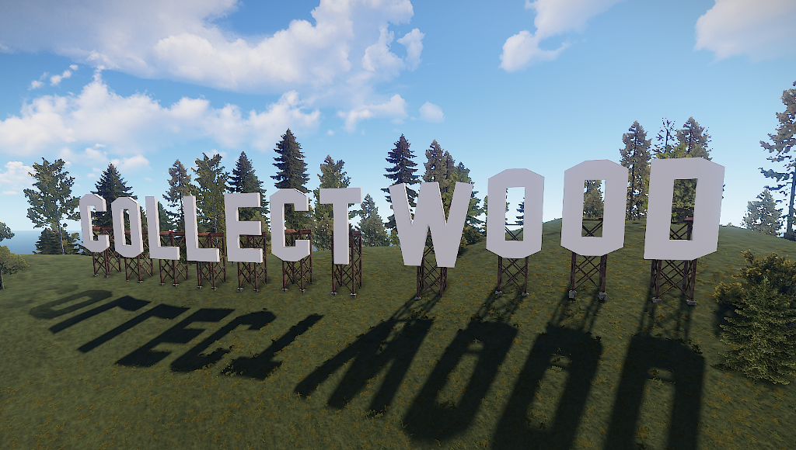
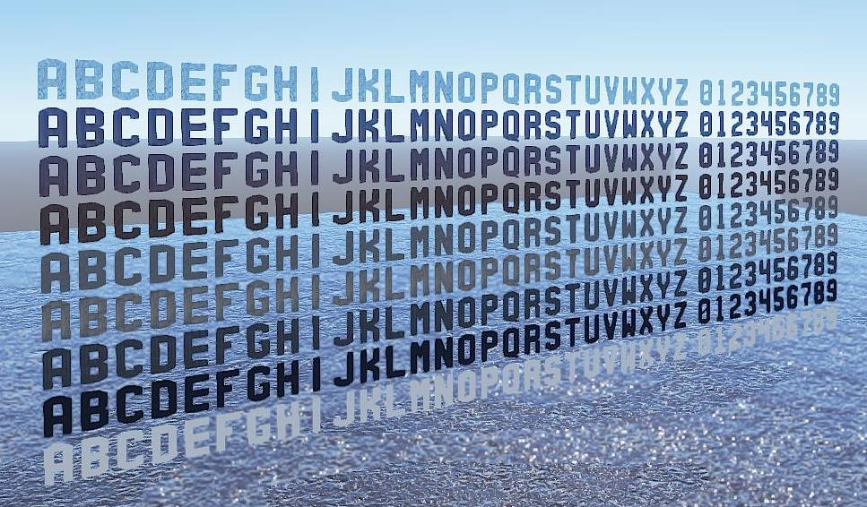

# Rust Alphabet

Rust Alphabet is a collection of giant letters in the style of the iconic Hollywood sign for the game [Rust](https://rust.facepunch.com/), to be used by creators of custom game maps. It comes with basic latin letters A-Z and numerals 0-9 and includes variants of the letters W, X and Y that are typographically digressive but more akin to the original signs letter style.

## Usage

Download the file prefab files and place them in the `RustEdit/CustomPrefabs` directory of [RustEdit](RustEdit/CustomPrefabs). The prefabs can be accessed in the custom section of the prefab browser. To use sinlge letters, the prefab has to be broken up by selecting it once placed and using the *Break prefab* function. Single letters can then be used by a dragging selection over the letters full extend. In the original scale, a *Movement snap* setting of 1 is recommended.

## Examples

## Variants

* [Black](alphabet.black.prefab)
* [White](alphabet.white.prefab)
* [Concrete (light)](alphabet.concrete.light.prefab)
* [Concrete (medium)](alphabet.concrete.medium.prefab)
* [Concrete (dark)](alphabet.concrete.dark.prefab)
* [Metal (Floor)](alphabet.metal.1.prefab)
* [Metal (Panels)](alphabet.metal.2.prefab)
* [Metal (Corregated)](alphabet.metal.3.prefab)
* [Ice](alphabet.ice.prefab)

## Contributions

* [Gray, red, green and glowing yellow](alphabet.glow.prefab) version. Special thanks to [Lone](https://lone.design/) for the IO handler cube prefabs.

* ~~[Original](alphabet.prefab) version~~ (Does not work with HDRP)
* ~~[Flat black](alphabet.flat.black.prefab) version by Brengun~~ (Does not work with HDRP)
* ~~[Flat white](alphabet.flat.white.prefab) version by Brengun~~ (Does not work with HDRP)
* ~~[Flat black & white 3D](alphabet.flat.3d.prefab) version by Brengun~~ (Does not work with HDRP)
* ~~[Alternative version](alphabet.hdrp.prefab)~~ (Will probably break someday)

## License

[Creative Commons Attribution 4.0](https://creativecommons.org/licenses/by/4.0/). 
